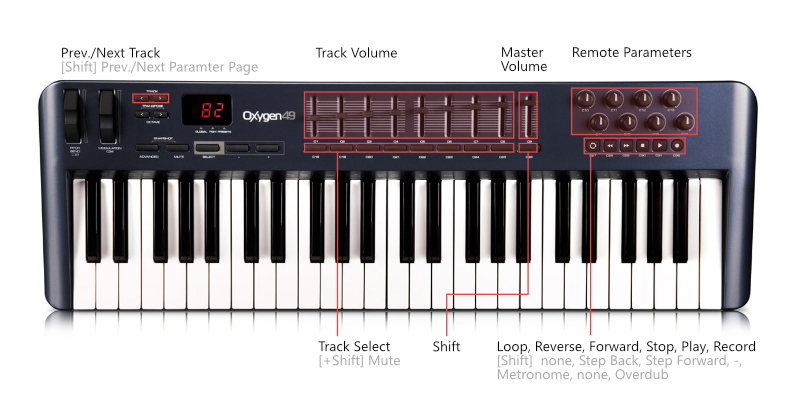

# M-Audio Oxygen 49 Extension for Bitwig Studio

## Installation
1. Download the the [latest](https://github.com/lplath/Oxygen49_Bitwig_Extension/releases/tag/0.2) release and place the .bwextension file into the following location:
   - macOS
   `Documents/Bitwig Studio/Extensions`
   - Windows
   `%USERPROFILE%\Documents\Bitwig Studio\Extensions`
   - Linux
   `~/Bitwig Studio/Extensions`
2. The script uses the default mapping of preset slot 10. 
To change the preset press `SELECT` until the display shows P. Then, using the `+` and `-` buttons select slot 10.
3. If your device was modified, it has to be reset. Either press `+` and `-` simulataneously during startup to reset the whole device or go to the controller-settings in Bitwig and press the `Reset` button. This will only affect slot 10